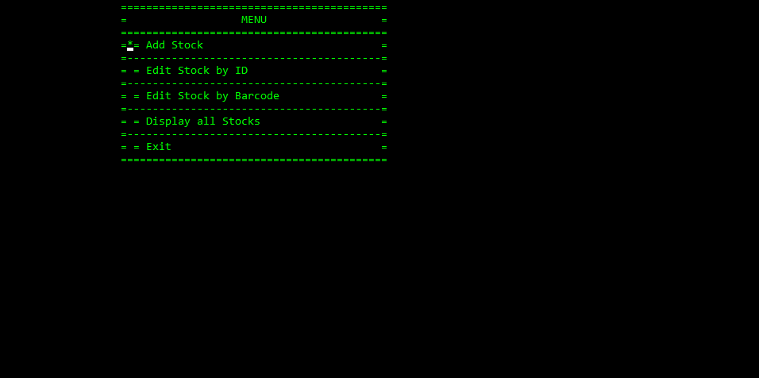

# Stock Manager

*Stock Manager is a very lightweight computer program for managing stocks.*
*It is the last and most complex project I made using the programming language "C"*

## Usage

To use Stock Manager:

1. Download StockManager or StockManager_x64
2. Run
3. Optionally, setup a barcode server and use a barcode reader to pass barcodes to the computer.

## Recommended Requirements

| --- | --- |
| Operating System  | Winows XP or better  				|
| CPU  				| Pentium 60 or better 				|
| GPU 				| VGA graphical card with DirectX	|
| RAM 				| 16MB 								|
| Memory 			| 80MB 								|
| Input 			| Compatible keyboard				|

## Adding Stocks

To add a new stock, select "Add Stock" option from the starting menu.

### Data Validation

| --- | --- |
| Stock ID (auto)  				| Automatically generated  							|
| Barcode  						| Maximum 30 characters 							|
| Name of Product 				| Maximum 50 characters 							|
| Name of Product 				| Maximum 50 characters 							|
| Quantity 						| Up to 9 digits, no decimal point 					|
| Price per Unit 				| Up to 9 digits before and after the decimal point	|
| Weight per Unit 				| Up to 9 digits before and after the decimal point	|
| Date of Import 				| Automatically selected, can be edited 			|
| Date of Export 				| Can only input valid dates 						|
| Note 							| Maximum 50 characters								|

## Memory

Memory is being allocated dynamically and deallocated when the program exits.

## History

I made this project as part of my summer internship at the Technical University of Sofia, specializing in the programming language "C" .

## References

The file "cons.c" is provided by a lector (Emo) in the Technical University of Sofia.